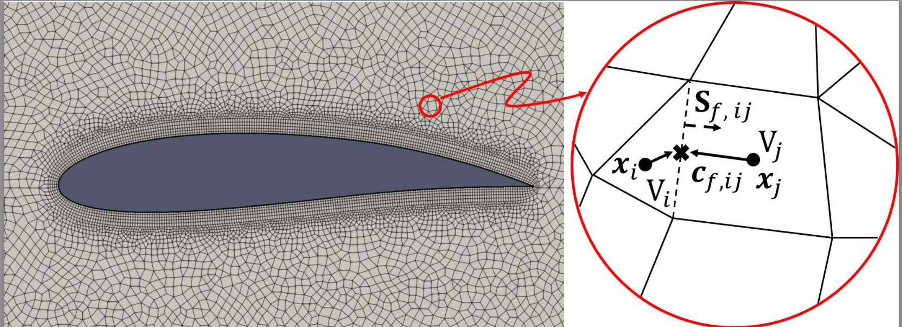

Finite Volume Features, Global Geometry Representations, and Residual Training for Deep Learning-based CFD Simulation
----
GNNs are one of the state-of-the-art surrogates for numerical CFD simulations. In this work, we propose two novel geometric representations, Shortest Vector (SV) and Directional Integrated Distance (DID), that provide a global geometry perspective to the nodes in GNNs. We also introduce Finite Volume Features (FVF) in the graph convolutions as node and edge attributes, enabling GNNs message-passing operations to adjust to different nodes. Experiments show that the proposed techniques help boost SOTA GNN-based methods performance by up to 41%.

**Datasets**

**Instructions**

**Dependencies**

- python==?
- pyTorch==?
- torch_geometric==?
- ..

Disclaimer: 
----
THIS SOFTWARE IS PROVIDED BY THE COPYRIGHT HOLDERS AND CONTRIBUTORS "AS IS" AND ANY EXPRESS OR IMPLIED WARRANTIES, INCLUDING, BUT NOT LIMITED TO, THE IMPLIED WARRANTIES OF MERCHANTABILITY AND FITNESS FOR A PARTICULAR PURPOSE ARE DISCLAIMED. IN NO EVENT SHALL THE COPYRIGHT HOLDER OR CONTRIBUTORS BE LIABLE FOR ANY DIRECT, INDIRECT, INCIDENTAL, SPECIAL, EXEMPLARY, OR CONSEQUENTIAL DAMAGES (INCLUDING, BUT NOT LIMITED TO, PROCUREMENT OF SUBSTITUTE GOODS OR SERVICES; LOSS OF USE, DATA, OR PROFITS; OR BUSINESS INTERRUPTION) HOWEVER CAUSED AND ON ANY THEORY OF LIABILITY, WHETHER IN CONTRACT, STRICT LIABILITY, OR TORT (INCLUDING NEGLIGENCE OR OTHERWISE) ARISING IN ANY WAY OUT OF THE USE OF THIS SOFTWARE, EVEN IF ADVISED OF THE POSSIBILITY OF SUCH DAMAGE.
